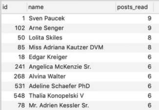

# MYSQL Practical examples

### How to find out what user am I logged as i

```mysql
SELECT USER(), CURRENT_USER();
```

### Show full tables

```mysql
SHOW FULL TABLES;
```

```mysql
 ALTER TABLE comments
    ADD FOREIGN KEY (post_id) REFERENCES posts (id) ON DELETE CASCADE ON UPDATE CASCADE;
```

### JOIN

* Note: that `innser join` is the same `join`

```mysql
SELECT *
FROM store
         JOIN address ON store.address_id = address.address_id;
```


```mysql
SELECT *
FROM store
         RIGHT JOIN address ON store.address_id = address.address_id;
```


```mysql
SELECT *
FROM store
         LEFT JOIN address ON store.address_id = address.address_id;
```


### JOIN and GROUP BY Example

```mysql
SELECT customer.customer_id,
       customer.first_name,
       customer.last_name,
       COUNT(rental_id)
FROM customer
         LEFT JOIN rental ON rental.customer_id = customer.customer_id
GROUP BY customer.customer_id;
```


### Multiple JOINS in One Query

```mysql
SELECT c.customer_id,
       c.first_name,
       c.last_name,
       store.store_id,
       COUNT(rental_id)   rentals_checked_out,
       address.address as store_adress
FROM customer c
         LEFT JOIN rental ON rental.customer_id = c.customer_id
         LEFT JOIN store ON store.store_id = c.store_id
         LEFT JOIN address ON address.address_id = store.address_id
GROUP BY c.customer_id, address.address;
```


### Filtering Aggregated Data

```mysql
SELECT title, SUM(amount) sales, COUNT(*) rentals
FROM rental
         JOIN payment ON payment.rental_id = rental.rental_id
         JOIN inventory ON inventory.inventory_id = rental.inventory_id
         JOIN film ON film.film_id = inventory.film_id
GROUP BY title
HAVING sales > 200
ORDER BY sales DESC;
```


### One-to-One Relationship

* `user` table has only one associated record into `profile` table

```mysql
SELECT *
FROM user
         JOIN profile ON user.id = profile.user_id;
```

### One-to-Many Relationship

* One user table can have many posts

```mysql
SELECT post.id, title, body, published_at, users.name author
from posts
         JOIN users ON users.id = posts.user_id
WHERE user_id = 1;
```

### Fetch the Most Popular Authors

```mysql
SELECT users.id, users.name, COUNT(*) post_read
FROM users
         LEFT JOIN post_reads
                   ON post_reads.post_id IN (SELECT id
                                             FROM posts
                                             WHERE user_id = users.id)
GROUP BY users.id
ORDER BY posts_read DESC
LIMIT 10;
```



### Determine the Average Rentals Per Day

```mysql
SELECT ROUND(AVG(total_rentals)) average_rent
FROM (SELECT date(rental_date) day, count(*) total_rentals
      FROM rental
      GROUP BY dAY
      ORDER BY DAY DESC) rentals;
```

